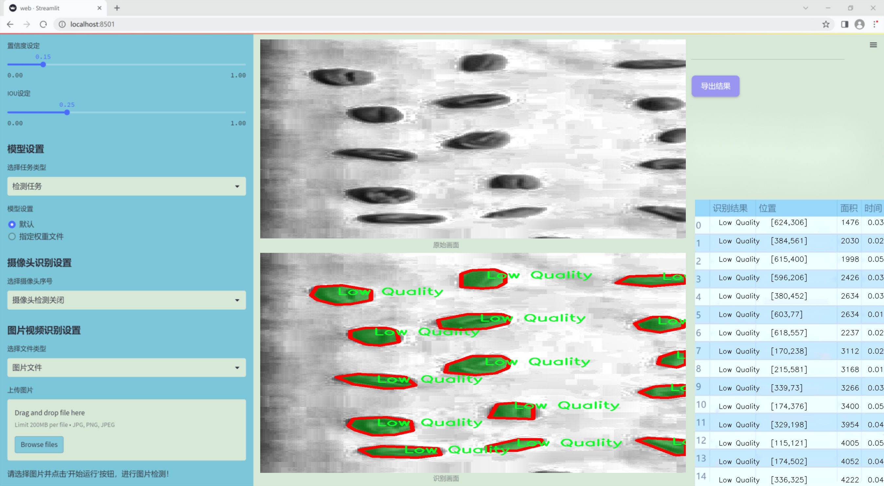
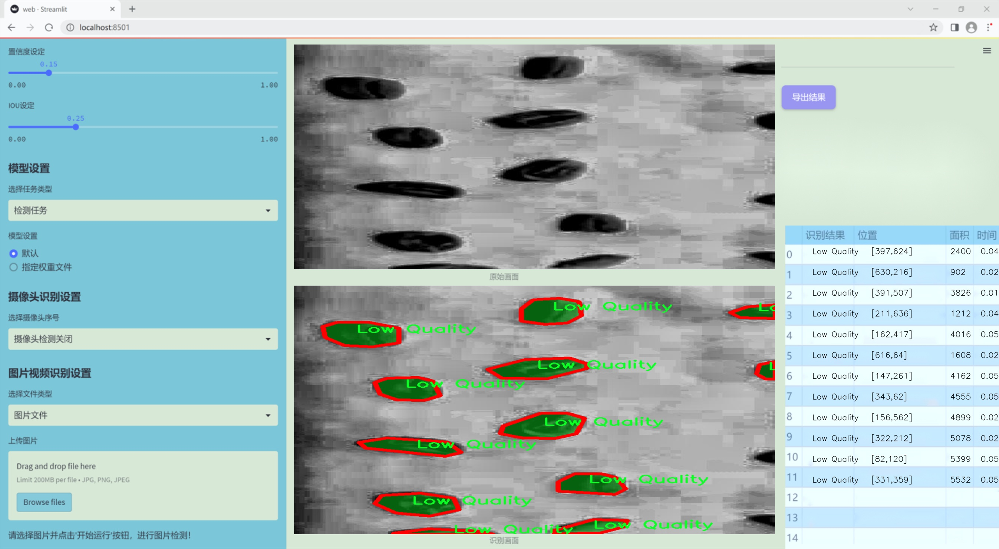
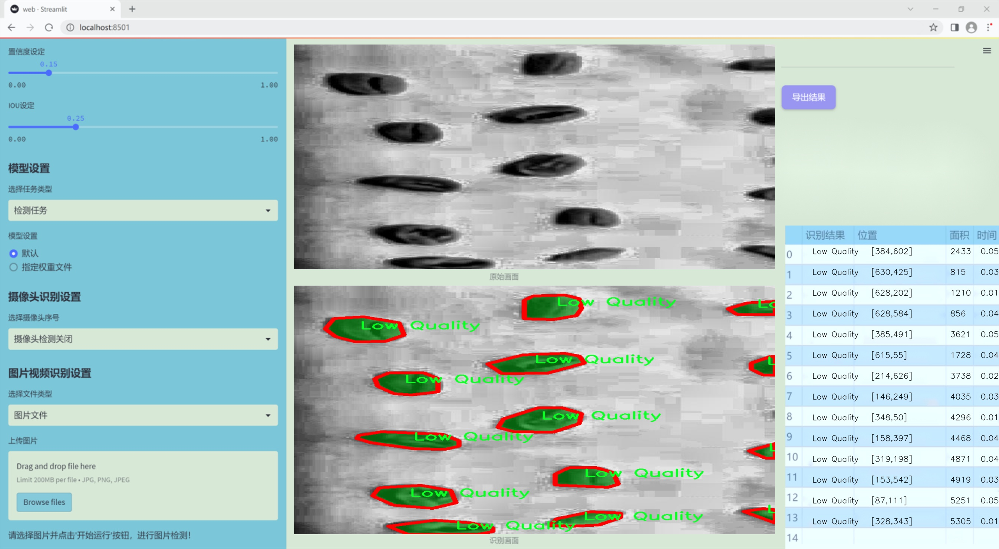
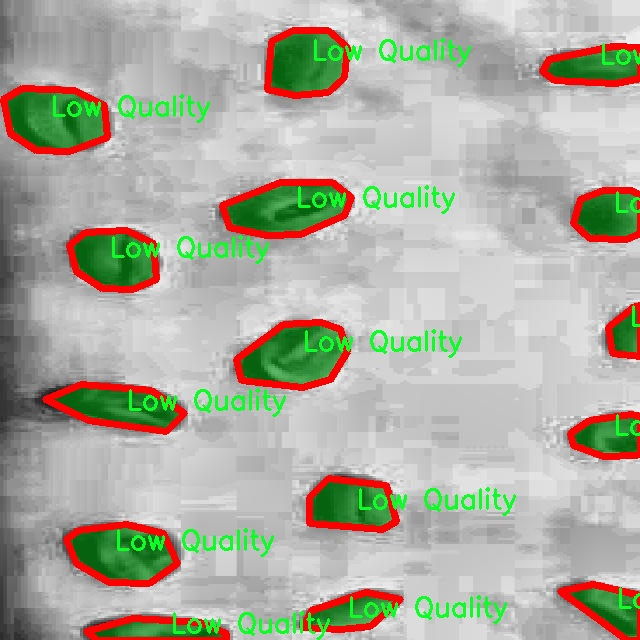
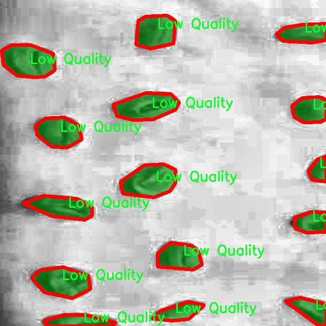
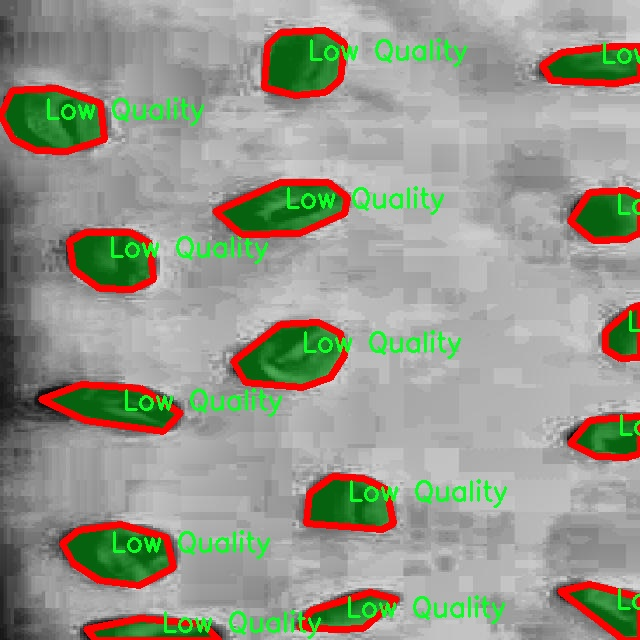
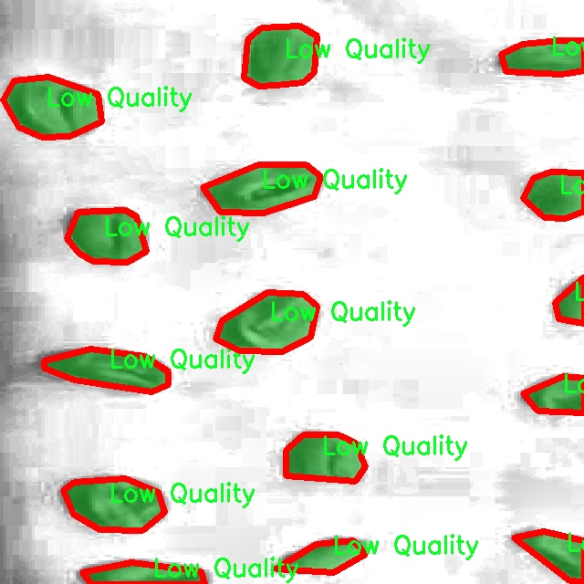

### 1.背景意义

### 研究背景与意义

咖啡作为全球最受欢迎的饮品之一，其品质直接影响着消费者的选择和市场的竞争力。随着咖啡消费的不断增长，如何高效、准确地对咖啡豆进行品质分级成为了一个亟待解决的问题。传统的咖啡豆品质评估方法主要依赖于人工检验，虽然能够提供一定的准确性，但由于人工操作的主观性和效率低下，往往难以满足现代市场的需求。因此，基于计算机视觉的自动化品质分级系统应运而生，成为提升咖啡豆品质检测效率的重要手段。

在这一背景下，基于改进YOLOv11的咖啡豆品质分级图像分割系统的研究具有重要的现实意义。YOLO（You Only Look Once）系列模型因其高效的实时检测能力而广泛应用于各种视觉任务。通过对YOLOv11进行改进，结合咖啡豆的特征和品质分级需求，可以实现对咖啡豆图像的快速、准确的分割与分类。该系统不仅能够自动识别和分类咖啡豆的品质（如优质、中等质量和低质量），还能够通过数据集中的大量样本进行深度学习，提升模型的准确性和鲁棒性。

本研究所使用的数据集包含3639张经过精细标注的咖啡豆图像，涵盖了不同品质的咖啡豆样本。这些图像经过了多种预处理和增强技术，以提高模型的训练效果和泛化能力。通过构建这样一个系统，不仅可以提高咖啡豆品质检测的效率，还能为咖啡产业提供数据支持，帮助生产者和消费者更好地理解和选择咖啡产品。此外，该系统的成功实施还可能为其他农产品的品质检测提供借鉴，推动农业领域的智能化发展。因此，基于改进YOLOv11的咖啡豆品质分级图像分割系统的研究，不仅具有重要的学术价值，也具备广泛的应用前景。

### 2.视频效果

[2.1 视频效果](https://www.bilibili.com/video/BV16amtYrERJ/)

### 3.图片效果







##### [项目涉及的源码数据来源链接](https://kdocs.cn/l/cszuIiCKVNis)**

注意：本项目提供训练的数据集和训练教程,由于版本持续更新,暂不提供权重文件（best.pt）,请按照6.训练教程进行训练后实现上图演示的效果。

### 4.数据集信息

##### 4.1 本项目数据集类别数＆类别名

nc: 3
names: ['Good Quality', 'Low Quality', 'Medium Quality']


该项目为【图像分割】数据集，请在【训练教程和Web端加载模型教程（第三步）】这一步的时候按照【图像分割】部分的教程来训练

##### 4.2 本项目数据集信息介绍

本项目数据集信息介绍

本项目旨在开发一个改进的YOLOv11模型，以实现咖啡豆品质的精准分级和图像分割。为此，我们构建了一个专门针对“Green Coffee Bean”的数据集，旨在提供高质量的训练样本，以提高模型的识别能力和分类准确性。该数据集包含三种主要类别，分别为“Good Quality”、“Low Quality”和“Medium Quality”，每个类别都代表了咖啡豆在不同生长和处理阶段的品质特征。

在数据集的构建过程中，我们特别注重样本的多样性和代表性。每个类别的样本均来自不同的咖啡种植区域和处理方式，确保模型能够学习到不同环境和处理条件下咖啡豆的品质差异。此外，数据集中包含了大量的图像，涵盖了咖啡豆的不同角度、光照条件和背景，以增强模型的鲁棒性。通过对图像进行精细的标注，我们为每个样本提供了详细的分割信息，使得模型能够在训练过程中有效地学习到每种品质的特征。

为了确保数据集的高质量，我们对每个类别的样本进行了严格的筛选和审核，确保只有符合标准的咖啡豆图像被纳入数据集中。这种精细化的处理不仅提高了数据集的整体质量，也为后续的模型训练提供了坚实的基础。最终，我们期望通过这一数据集的应用，能够显著提升YOLOv11在咖啡豆品质分级和图像分割任务中的表现，从而为咖啡产业的品质控制和市场流通提供更为精准的技术支持。










### 5.全套项目环境部署视频教程（零基础手把手教学）

[5.1 所需软件PyCharm和Anaconda安装教程（第一步）](https://www.bilibili.com/video/BV1BoC1YCEKi/?spm_id_from=333.999.0.0&vd_source=bc9aec86d164b67a7004b996143742dc)


[5.2 安装Python虚拟环境创建和依赖库安装视频教程（第二步）](https://www.bilibili.com/video/BV1ZoC1YCEBw?spm_id_from=333.788.videopod.sections&vd_source=bc9aec86d164b67a7004b996143742dc)

### 6.改进YOLOv11训练教程和Web_UI前端加载模型教程（零基础手把手教学）

[6.1 改进YOLOv11训练教程和Web_UI前端加载模型教程（第三步）](https://www.bilibili.com/video/BV1BoC1YCEhR?spm_id_from=333.788.videopod.sections&vd_source=bc9aec86d164b67a7004b996143742dc)


按照上面的训练视频教程链接加载项目提供的数据集，运行train.py即可开始训练



     Epoch   gpu_mem       box       obj       cls    labels  img_size
     1/200     20.8G   0.01576   0.01955  0.007536        22      1280: 100%|██████████| 849/849 [14:42<00:00,  1.04s/it]
               Class     Images     Labels          P          R     mAP@.5 mAP@.5:.95: 100%|██████████| 213/213 [01:14<00:00,  2.87it/s]
                 all       3395      17314      0.994      0.957      0.0957      0.0843

     Epoch   gpu_mem       box       obj       cls    labels  img_size
     2/200     20.8G   0.01578   0.01923  0.007006        22      1280: 100%|██████████| 849/849 [14:44<00:00,  1.04s/it]
               Class     Images     Labels          P          R     mAP@.5 mAP@.5:.95: 100%|██████████| 213/213 [01:12<00:00,  2.95it/s]
                 all       3395      17314      0.996      0.956      0.0957      0.0845

     Epoch   gpu_mem       box       obj       cls    labels  img_size
     3/200     20.8G   0.01561    0.0191  0.006895        27      1280: 100%|██████████| 849/849 [10:56<00:00,  1.29it/s]
               Class     Images     Labels          P          R     mAP@.5 mAP@.5:.95: 100%|███████   | 187/213 [00:52<00:00,  4.04it/s]
                 all       3395      17314      0.996      0.957      0.0957      0.0845


###### [项目数据集下载链接](https://kdocs.cn/l/cszuIiCKVNis)

### 7.原始YOLOv11算法讲解

YOLOv11是一种由Ultralytics公司开发的最新一代目标检测模型，以其增强的特征提取能力和更高的效率在计算机视觉领域引人注目。该模型在架构上进行了关键升级，通过更新主干和颈部结构，显著提高了对复杂视觉场景的理解和处理精度。YOLOv11不仅在目标检测上表现出色，还支持实例分割、图像分类、姿态估计和定向目标检测（OBB）等任务，展示出其多功能性。

与其前身YOLOv8相比，YOLOv11在设计上实现了深度和宽度的改变，同时引入了几个创新机制。其中，C3k2机制是对YOLOv8中的C2f的改进，提升了浅层特征的处理能力；C2PSA机制则进一步优化了特征图的处理流程。解耦头的创新设计，通过增加两个深度卷积（DWConv），提高了模型对细节的感知能力和分类准确性。

在性能上，YOLOv11m模型在COCO数据集上的平均精度（mAP）提高，并减少了22%的参数量，确保了在运算效率上的突破。该模型可以部署在多种平台上，包括边缘设备、云平台以及支持NVIDIA GPU的系统，彰显出卓越的灵活性和适应性。总体而言，YOLOv11通过一系列的创新突破，对目标检测领域产生了深远的影响，并为未来的开发提供了新的研究方向。


****文档**** ： _ _https://docs.ultralytics.com/models/yolo11/__

****代码链接**** ： _ _https://github.com/ultralytics/ultralytics__

******Performance Metrics******


​ ** **关键特性****

****◆**** ** **增强的特征提取能力**** ：YOLO11采用了改进的主干和颈部架构，增强了 ** **特征提取****
能力，能够实现更精确的目标检测和复杂任务的执行。

****◆**** ** **优化的效率和速度****
：YOLO11引入了精细化的架构设计和优化的训练流程，提供更快的处理速度，并在准确性和性能之间保持最佳平衡。

****◆**** ** **参数更少、精度更高****
：通过模型设计的改进，YOLO11m在COCO数据集上实现了更高的平均精度（mAP），同时使用的参数比YOLOv8m少22%，使其在计算上更加高效，而不牺牲准确性。

****◆**** ** **跨环境的适应性**** ：YOLO11可以无缝部署在各种环境中，包括边缘设备、云平台和支持NVIDIA
GPU的系统，确保最大的灵活性。

****◆**** ** **支持广泛任务****
：无论是目标检测、实例分割、图像分类、姿态估计还是定向目标检测（OBB），YOLO11都旨在应对一系列计算机视觉挑战。

****支持的任务和模式****


​YOLO11建立在YOLOv8中引入的多功能模型范围之上，为各种计算机视觉任务提供增强的支持:


​该表提供了YOLO11模型变体的概述，展示了它们在特定任务中的适用性以及与Inference、Validation、Training和Export等操作模式的兼容性。从实时检测到复杂的分割任务
，这种灵活性使YOLO11适用于计算机视觉的广泛应用。

##### yolov11的创新

■ yolov8 VS yolov11

YOLOv5，YOLOv8和YOLOv11均是ultralytics公司的作品，ultralytics出品必属精品。


​ **具体创新点** ：

**① 深度（depth）和宽度 （width）**

YOLOv8和YOLOv11是基本上完全不同。

**② C3k2机制**

C3k2有参数为c3k，其中在网络的浅层c3k设置为False。C3k2就相当于YOLOv8中的C2f。


​ **③ C2PSA机制**

下图为C2PSA机制的原理图。


​ **④ 解耦头**

解耦头中的分类检测头增加了两个 **DWConv** 。


▲Conv

    
    
    def autopad(k, p=None, d=1):  # kernel, padding, dilation
    
        """Pad to 'same' shape outputs."""
    
        if d > 1:
    
            k = d * (k - 1) + 1 if isinstance(k, int) else [d * (x - 1) + 1 for x in k]  # actual kernel-size
    
        if p is None:
    
            p = k // 2 if isinstance(k, int) else [x // 2 for x in k]  # auto-pad
    
    return p
    
    
    class Conv(nn.Module):
    
        """Standard convolution with args(ch_in, ch_out, kernel, stride, padding, groups, dilation, activation)."""
    
    
        default_act = nn.SiLU()  # default activation
    
    
        def __init__(self, c1, c2, k=1, s=1, p=None, g=1, d=1, act=True):
    
            """Initialize Conv layer with given arguments including activation."""
    
            super().__init__()
    
            self.conv = nn.Conv2d(c1, c2, k, s, autopad(k, p, d), groups=g, dilation=d, bias=False)
    
            self.bn = nn.BatchNorm2d(c2)
    
            self.act = self.default_act if act is True else act if isinstance(act, nn.Module) else nn.Identity()
    
    
        def forward(self, x):
    
            """Apply convolution, batch normalization and activation to input tensor."""
    
            return self.act(self.bn(self.conv(x)))
    
    
        def forward_fuse(self, x):
    
            """Perform transposed convolution of 2D data."""
    
            return self.act(self.conv(x))

▲Conv2d

    
    
    torch.nn.Conv2d(in_channels, out_channels, kernel_size, stride=1, padding=0, dilation=1, groups=1, bias=True, padding_mode='zeros')

▲DWConv

DWConv ** **代表 Depthwise Convolution（深度卷积）****
，是一种在卷积神经网络中常用的高效卷积操作。它主要用于减少计算复杂度和参数量。

    
    
    class DWConv(Conv):
    
        """Depth-wise convolution."""
    
    
        def __init__(self, c1, c2, k=1, s=1, d=1, act=True):  # ch_in, ch_out, kernel, stride, dilation, activation
    
            """Initialize Depth-wise convolution with given parameters."""
    
            super().__init__(c1, c2, k, s, g=math.gcd(c1, c2), d=d, act=act)


### 8.200+种全套改进YOLOV11创新点原理讲解

#### 8.1 200+种全套改进YOLOV11创新点原理讲解大全

由于篇幅限制，每个创新点的具体原理讲解就不全部展开，具体见下列网址中的改进模块对应项目的技术原理博客网址【Blog】（创新点均为模块化搭建，原理适配YOLOv5~YOLOv11等各种版本）

[改进模块技术原理博客【Blog】网址链接](https://gitee.com/qunmasj/good)


#### 8.2 精选部分改进YOLOV11创新点原理讲解

###### 这里节选部分改进创新点展开原理讲解(完整的改进原理见上图和[改进模块技术原理博客链接](https://gitee.com/qunmasj/good)【如果此小节的图加载失败可以通过CSDN或者Github搜索该博客的标题访问原始博客，原始博客图片显示正常】


### HRNet V2简介
现在设计高低分辨率融合的思路主要有以下四种：


（a）对称结构。如U-Net、Hourglass等，都是先下采样再上采样，上下采样过程对称。

（b）级联金字塔。如refinenet等，高低分辨率融合时经过卷积处理。

（c）简单的baseline，用转职卷积进行上采样。

（d）扩张卷积。如deeplab等，增大感受野，减少下采样次数，可以无需跳层连接直接进行上采样。

（b）（c）都是使用复杂一些的网络进行下采样（如resnet、vgg），再用轻量级的网络进行上采样。

HRNet V1是在（b）的基础上进行改进，从头到尾保持大的分辨率表示。然而HRNet V1仅是用在姿态估计领域的，HRNet V2对它做小小的改进可以使其适用于更广的视觉任务。这一改进仅仅增加了较小的计算开销，但却提升了较大的准确度。

#### 网络结构图：


这个结构图简洁明了就不多介绍了，首先图2的输入是已经经过下采样四倍的feature map，横向的conv block指的是basicblock 或 bottleblock，不同分辨率之间的多交叉线部分是multi-resolution convolution（多分辨率组卷积）。

到此为止HRNet V2和HRNet V1是完全一致的。

区别之处在于这个基网络上加的一个head：


图3介绍的是接在图2最后的head。（a）是HRNet V1的头，很明显他只用了大分辨率的特征图。（b）（c）是HRNet V2的创新点，（b）用与语义分割，（c）用于目标检测。除此之外作者还在实验部分介绍了用于分类的head，如图4所示。


#### 多分辨率block：


一个多分辨率block由多分辨率组卷积（a）和多分辨率卷积（b）组成。（c）是一个正常卷积的展开，（b）的灵感来源于（c）。代码中（a）部分由Bottleneck和BasicBlock组成。

多分辨率卷积和正常卷积的区别：（1）多分辨率卷积中，每个通道的subset的分辨率都不一样。（2）通道之间的连接如果是降分辨率，则用的是3x3的2stride的卷积，如果是升分辨率，用的是双线性最邻近插值上采样。


### 9.系统功能展示

图9.1.系统支持检测结果表格显示

  图9.2.系统支持置信度和IOU阈值手动调节

  图9.3.系统支持自定义加载权重文件best.pt(需要你通过步骤5中训练获得)

  图9.4.系统支持摄像头实时识别

  图9.5.系统支持图片识别

  图9.6.系统支持视频识别

  图9.7.系统支持识别结果文件自动保存

  图9.8.系统支持Excel导出检测结果数据


### 10. YOLOv11核心改进源码讲解

#### 10.1 fasternet.py

以下是经过简化和注释的核心代码部分，保留了主要的结构和功能，并添加了详细的中文注释。

```python
import torch
import torch.nn as nn
from typing import List
from torch import Tensor

class PartialConv3(nn.Module):
    """部分卷积层，用于在训练和推理时处理输入特征图。"""

    def __init__(self, dim, n_div, forward):
        super().__init__()
        self.dim_conv3 = dim // n_div  # 计算部分卷积的通道数
        self.dim_untouched = dim - self.dim_conv3  # 未改变的通道数
        self.partial_conv3 = nn.Conv2d(self.dim_conv3, self.dim_conv3, 3, 1, 1, bias=False)  # 定义卷积层

        # 根据前向传播方式选择对应的函数
        if forward == 'slicing':
            self.forward = self.forward_slicing
        elif forward == 'split_cat':
            self.forward = self.forward_split_cat
        else:
            raise NotImplementedError

    def forward_slicing(self, x: Tensor) -> Tensor:
        """推理时的前向传播，只处理部分通道。"""
        x = x.clone()  # 保持原始输入不变，以便后续的残差连接
        x[:, :self.dim_conv3, :, :] = self.partial_conv3(x[:, :self.dim_conv3, :, :])  # 处理部分通道
        return x

    def forward_split_cat(self, x: Tensor) -> Tensor:
        """训练和推理时的前向传播，分割和拼接特征图。"""
        x1, x2 = torch.split(x, [self.dim_conv3, self.dim_untouched], dim=1)  # 分割输入
        x1 = self.partial_conv3(x1)  # 处理分割的部分
        x = torch.cat((x1, x2), 1)  # 拼接回去
        return x


class MLPBlock(nn.Module):
    """多层感知机模块，用于特征处理。"""

    def __init__(self, dim, n_div, mlp_ratio, drop_path, layer_scale_init_value, act_layer, norm_layer, pconv_fw_type):
        super().__init__()
        self.dim = dim
        self.mlp_ratio = mlp_ratio
        self.drop_path = nn.Identity() if drop_path <= 0 else DropPath(drop_path)  # 随机深度
        self.n_div = n_div

        mlp_hidden_dim = int(dim * mlp_ratio)  # 计算隐藏层维度

        # 定义MLP层
        mlp_layer: List[nn.Module] = [
            nn.Conv2d(dim, mlp_hidden_dim, 1, bias=False),
            norm_layer(mlp_hidden_dim),
            act_layer(),
            nn.Conv2d(mlp_hidden_dim, dim, 1, bias=False)
        ]
        self.mlp = nn.Sequential(*mlp_layer)  # 将MLP层组合成序列

        # 定义空间混合层
        self.spatial_mixing = PartialConv3(dim, n_div, pconv_fw_type)

        # 如果需要，初始化层缩放参数
        if layer_scale_init_value > 0:
            self.layer_scale = nn.Parameter(layer_scale_init_value * torch.ones((dim)), requires_grad=True)
            self.forward = self.forward_layer_scale  # 使用层缩放的前向传播
        else:
            self.forward = self.forward  # 默认前向传播

    def forward(self, x: Tensor) -> Tensor:
        """前向传播函数。"""
        shortcut = x  # 保存输入以便进行残差连接
        x = self.spatial_mixing(x)  # 进行空间混合
        x = shortcut + self.drop_path(self.mlp(x))  # 残差连接
        return x

    def forward_layer_scale(self, x: Tensor) -> Tensor:
        """带层缩放的前向传播。"""
        shortcut = x
        x = self.spatial_mixing(x)
        x = shortcut + self.drop_path(self.layer_scale.unsqueeze(-1).unsqueeze(-1) * self.mlp(x))  # 残差连接与层缩放
        return x


class FasterNet(nn.Module):
    """FasterNet模型，包含多个阶段和模块。"""

    def __init__(self, in_chans=3, num_classes=1000, embed_dim=96, depths=(1, 2, 8, 2), mlp_ratio=2., n_div=4,
                 patch_size=4, patch_stride=4, patch_size2=2, patch_stride2=2, patch_norm=True,
                 drop_path_rate=0.1, layer_scale_init_value=0, norm_layer='BN', act_layer='RELU', pconv_fw_type='split_cat'):
        super().__init__()

        # 选择归一化层和激活函数
        norm_layer = nn.BatchNorm2d if norm_layer == 'BN' else NotImplementedError
        act_layer = partial(nn.ReLU, inplace=True) if act_layer == 'RELU' else NotImplementedError

        self.num_stages = len(depths)  # 模型阶段数量
        self.embed_dim = embed_dim  # 嵌入维度
        self.patch_norm = patch_norm  # 是否使用归一化
        self.mlp_ratio = mlp_ratio  # MLP比率
        self.depths = depths  # 每个阶段的深度

        # 图像分块嵌入
        self.patch_embed = PatchEmbed(patch_size=patch_size, patch_stride=patch_stride, in_chans=in_chans,
                                       embed_dim=embed_dim, norm_layer=norm_layer if self.patch_norm else None)

        # 随机深度衰减规则
        dpr = [x.item() for x in torch.linspace(0, drop_path_rate, sum(depths))]

        # 构建各个阶段
        stages_list = []
        for i_stage in range(self.num_stages):
            stage = BasicStage(dim=int(embed_dim * 2 ** i_stage), n_div=n_div, depth=depths[i_stage],
                               mlp_ratio=self.mlp_ratio, drop_path=dpr[sum(depths[:i_stage]):sum(depths[:i_stage + 1])],
                               layer_scale_init_value=layer_scale_init_value, norm_layer=norm_layer,
                               act_layer=act_layer, pconv_fw_type=pconv_fw_type)
            stages_list.append(stage)

            # 添加分块合并层
            if i_stage < self.num_stages - 1:
                stages_list.append(PatchMerging(patch_size2=patch_size2, patch_stride2=patch_stride2,
                                                 dim=int(embed_dim * 2 ** i_stage), norm_layer=norm_layer))

        self.stages = nn.Sequential(*stages_list)  # 将所有阶段组合成序列

    def forward(self, x: Tensor) -> Tensor:
        """前向传播，输出四个阶段的特征。"""
        x = self.patch_embed(x)  # 进行图像分块嵌入
        outs = []
        for idx, stage in enumerate(self.stages):
            x = stage(x)  # 通过每个阶段
            if idx in self.out_indices:  # 如果是输出阶段
                norm_layer = getattr(self, f'norm{idx}')  # 获取归一化层
                x_out = norm_layer(x)  # 进行归一化
                outs.append(x_out)  # 保存输出
        return outs

# 省略了其他辅助函数和模型构建函数，主要集中在模型的核心部分
```

在上述代码中，核心部分主要包括 `PartialConv3`、`MLPBlock` 和 `FasterNet` 类。这些类定义了模型的基本结构和前向传播逻辑。每个类都有详细的中文注释，解释了其功能和工作原理。

这个程序文件 `fasternet.py` 实现了一个名为 FasterNet 的深度学习模型，主要用于图像处理任务。该模型的结构基于多层的卷积和全连接层，采用了现代深度学习中的一些技术，如分块卷积、残差连接和层归一化等。以下是对代码的逐步分析。

首先，文件引入了一些必要的库，包括 PyTorch、YAML 以及一些用于构建神经网络的模块。接着，定义了一些基本的类和函数。

`Partial_conv3` 类实现了一个部分卷积层，可以根据不同的前向传播方式（切片或拼接）来处理输入数据。这个类的设计使得在推理和训练阶段可以灵活地选择不同的处理方式。

`MLPBlock` 类实现了一个多层感知机（MLP）模块，包含两个卷积层和一个激活函数，支持残差连接和可选的层缩放。这个模块通过 `DropPath` 实现了随机深度的功能，有助于提高模型的泛化能力。

`BasicStage` 类则是由多个 `MLPBlock` 组成的阶段，负责将输入数据经过一系列的处理。这个类的设计使得模型可以通过堆叠多个阶段来增加深度。

`PatchEmbed` 和 `PatchMerging` 类分别用于将输入图像分割成补丁并进行嵌入，以及在不同阶段之间进行补丁的合并。这些操作有助于减少计算量并提高模型的效率。

`FasterNet` 类是整个模型的核心，负责定义模型的整体结构。它接受多个参数来配置模型的不同层次，包括输入通道数、类别数、嵌入维度、各层的深度等。模型的构建过程中，会依次创建补丁嵌入层、多个基本阶段以及补丁合并层，并为每个输出添加归一化层。

在模型的 `forward` 方法中，输入数据首先经过补丁嵌入层，然后依次通过各个阶段进行处理，最后输出特征。这些特征可以用于后续的分类或其他任务。

文件还定义了一些辅助函数，如 `update_weight` 用于更新模型的权重，确保加载的权重与模型结构匹配。接下来是几个用于创建不同版本 FasterNet 的函数（如 `fasternet_t0`、`fasternet_t1` 等），这些函数会读取配置文件并加载预训练权重。

最后，在文件的主程序部分，示例代码展示了如何使用 `fasternet_t0` 函数创建模型，并打印模型的输出通道和输入的尺寸。这部分代码可以用于测试模型的基本功能。

总体而言，这个文件实现了一个灵活且高效的深度学习模型，适用于各种图像处理任务，并通过模块化的设计使得模型的扩展和修改变得更加容易。

#### 10.2 convnextv2.py

以下是代码中最核心的部分，并附上详细的中文注释：

```python
import torch
import torch.nn as nn
import torch.nn.functional as F

class LayerNorm(nn.Module):
    """ 自定义的LayerNorm层，支持两种数据格式：channels_last（默认）和channels_first。
    channels_last对应的输入形状为(batch_size, height, width, channels)，
    而channels_first对应的输入形状为(batch_size, channels, height, width)。
    """
    def __init__(self, normalized_shape, eps=1e-6, data_format="channels_last"):
        super().__init__()
        # 权重和偏置初始化
        self.weight = nn.Parameter(torch.ones(normalized_shape))
        self.bias = nn.Parameter(torch.zeros(normalized_shape))
        self.eps = eps
        self.data_format = data_format
        if self.data_format not in ["channels_last", "channels_first"]:
            raise NotImplementedError 
        self.normalized_shape = (normalized_shape, )
    
    def forward(self, x):
        # 根据数据格式选择不同的归一化方式
        if self.data_format == "channels_last":
            return F.layer_norm(x, self.normalized_shape, self.weight, self.bias, self.eps)
        elif self.data_format == "channels_first":
            u = x.mean(1, keepdim=True)  # 计算均值
            s = (x - u).pow(2).mean(1, keepdim=True)  # 计算方差
            x = (x - u) / torch.sqrt(s + self.eps)  # 标准化
            x = self.weight[:, None, None] * x + self.bias[:, None, None]  # 应用权重和偏置
            return x

class Block(nn.Module):
    """ ConvNeXtV2的基本模块，包含深度可分离卷积、归一化、激活函数等。
    
    Args:
        dim (int): 输入通道数。
    """
    def __init__(self, dim):
        super().__init__()
        self.dwconv = nn.Conv2d(dim, dim, kernel_size=7, padding=3, groups=dim)  # 深度可分离卷积
        self.norm = LayerNorm(dim, eps=1e-6)  # 归一化层
        self.pwconv1 = nn.Linear(dim, 4 * dim)  # 1x1卷积（用线性层实现）
        self.act = nn.GELU()  # 激活函数
        self.pwconv2 = nn.Linear(4 * dim, dim)  # 1x1卷积（用线性层实现）

    def forward(self, x):
        input = x  # 保存输入以便后续残差连接
        x = self.dwconv(x)  # 深度可分离卷积
        x = self.norm(x)  # 归一化
        x = self.pwconv1(x)  # 第一个1x1卷积
        x = self.act(x)  # 激活
        x = self.pwconv2(x)  # 第二个1x1卷积
        x = input + x  # 残差连接
        return x

class ConvNeXtV2(nn.Module):
    """ ConvNeXt V2模型定义。
    
    Args:
        in_chans (int): 输入图像的通道数。默认值：3
        num_classes (int): 分类头的类别数。默认值：1000
        depths (tuple(int)): 每个阶段的块数。默认值：[3, 3, 9, 3]
        dims (int): 每个阶段的特征维度。默认值：[96, 192, 384, 768]
    """
    def __init__(self, in_chans=3, num_classes=1000, 
                 depths=[3, 3, 9, 3], dims=[96, 192, 384, 768]):
        super().__init__()
        self.downsample_layers = nn.ModuleList()  # 下采样层列表
        # 定义stem层
        stem = nn.Sequential(
            nn.Conv2d(in_chans, dims[0], kernel_size=4, stride=4),
            LayerNorm(dims[0], eps=1e-6, data_format="channels_first")
        )
        self.downsample_layers.append(stem)
        # 定义后续的下采样层
        for i in range(3):
            downsample_layer = nn.Sequential(
                    LayerNorm(dims[i], eps=1e-6, data_format="channels_first"),
                    nn.Conv2d(dims[i], dims[i+1], kernel_size=2, stride=2),
            )
            self.downsample_layers.append(downsample_layer)

        self.stages = nn.ModuleList()  # 特征分辨率阶段，每个阶段包含多个残差块
        for i in range(4):
            stage = nn.Sequential(
                *[Block(dim=dims[i]) for _ in range(depths[i])]
            )
            self.stages.append(stage)

        self.norm = nn.LayerNorm(dims[-1], eps=1e-6)  # 最后的归一化层
        self.head = nn.Linear(dims[-1], num_classes)  # 分类头

    def forward(self, x):
        for i in range(4):
            x = self.downsample_layers[i](x)  # 下采样
            x = self.stages[i](x)  # 通过当前阶段的块
        return x  # 返回最后的特征图
```

### 代码核心部分说明：
1. **LayerNorm**: 自定义的层归一化模块，支持不同的输入格式。
2. **Block**: ConvNeXtV2的基本构建块，包含深度可分离卷积、归一化和激活等操作。
3. **ConvNeXtV2**: 主模型类，定义了网络的结构，包括下采样层和多个特征提取阶段。

这个程序文件定义了一个名为 `ConvNeXtV2` 的深度学习模型，主要用于图像分类任务。该模型是基于卷积神经网络（CNN）的架构，结合了一些新的设计理念和技术，旨在提高性能和效率。

文件首先导入了必要的库，包括 PyTorch 和一些用于模型构建的工具。接着，定义了一些基础组件，包括 `LayerNorm` 和 `GRN`。`LayerNorm` 是一种层归一化的实现，支持两种数据格式（通道优先和通道后）。它的主要作用是对输入进行归一化处理，以提高模型的稳定性和收敛速度。`GRN`（全局响应归一化）层则通过计算输入的 L2 范数来进行归一化，增强了模型对特征的响应能力。

接下来，定义了 `Block` 类，这是 ConvNeXtV2 的基本构建块。每个块包含一个深度卷积层、归一化层、点卷积层和激活函数。块内还引入了随机深度（Drop Path）机制，以增强模型的泛化能力。`ConvNeXtV2` 类则是整个模型的核心，包含多个阶段，每个阶段由多个 `Block` 组成。模型的构造函数允许用户自定义输入通道数、分类数、每个阶段的块数和特征维度等参数。

在模型的前向传播过程中，输入图像经过多个下采样层和特征提取阶段，最终输出特征图。模型还包含一个线性层作为分类头，用于将提取的特征映射到类别标签。

此外，文件中还定义了一些函数，用于创建不同规模的 ConvNeXtV2 模型（如 atto、femto、pico 等），这些函数允许用户加载预训练权重，以便在特定任务上进行微调。

最后，`update_weight` 函数用于更新模型的权重，确保加载的权重与模型结构相匹配。整体而言，这个文件实现了一个灵活且高效的图像分类模型，适用于各种深度学习任务。

#### 10.3 mobilenetv4.py

以下是代码中最核心的部分，并附上详细的中文注释：

```python
import torch
import torch.nn as nn

# 定义构建卷积层的函数
def conv_2d(inp, oup, kernel_size=3, stride=1, groups=1, bias=False, norm=True, act=True):
    conv = nn.Sequential()
    padding = (kernel_size - 1) // 2  # 计算填充
    # 添加卷积层
    conv.add_module('conv', nn.Conv2d(inp, oup, kernel_size, stride, padding, bias=bias, groups=groups))
    if norm:
        # 添加批归一化层
        conv.add_module('BatchNorm2d', nn.BatchNorm2d(oup))
    if act:
        # 添加激活函数层
        conv.add_module('Activation', nn.ReLU6())
    return conv

# 定义反向残差块
class InvertedResidual(nn.Module):
    def __init__(self, inp, oup, stride, expand_ratio, act=False):
        super(InvertedResidual, self).__init__()
        self.stride = stride
        assert stride in [1, 2]  # 验证步幅只能是1或2
        hidden_dim = int(round(inp * expand_ratio))  # 计算隐藏层维度
        self.block = nn.Sequential()
        if expand_ratio != 1:
            # 如果扩展比不为1，添加1x1卷积层
            self.block.add_module('exp_1x1', conv_2d(inp, hidden_dim, kernel_size=1, stride=1))
        # 添加深度可分离卷积层
        self.block.add_module('conv_3x3', conv_2d(hidden_dim, hidden_dim, kernel_size=3, stride=stride, groups=hidden_dim))
        # 添加投影卷积层
        self.block.add_module('red_1x1', conv_2d(hidden_dim, oup, kernel_size=1, stride=1, act=act))
        # 判断是否使用残差连接
        self.use_res_connect = self.stride == 1 and inp == oup

    def forward(self, x):
        if self.use_res_connect:
            # 如果使用残差连接，返回输入与卷积结果的和
            return x + self.block(x)
        else:
            return self.block(x)

# 定义MobileNetV4模型
class MobileNetV4(nn.Module):
    def __init__(self, model):
        super().__init__()
        self.model = model
        # 构建模型的各个层
        self.conv0 = build_blocks(self.spec['conv0'])
        self.layer1 = build_blocks(self.spec['layer1'])
        self.layer2 = build_blocks(self.spec['layer2'])
        self.layer3 = build_blocks(self.spec['layer3'])
        self.layer4 = build_blocks(self.spec['layer4'])
        self.layer5 = build_blocks(self.spec['layer5'])
        self.features = nn.ModuleList([self.conv0, self.layer1, self.layer2, self.layer3, self.layer4, self.layer5])     

    def forward(self, x):
        features = [None, None, None, None]
        for f in self.features:
            x = f(x)  # 逐层前向传播
            # 根据输入大小记录特征图
            if input_size // x.size(2) in scale:
                features[scale.index(input_size // x.size(2))] = x
        return features

# 创建不同版本的MobileNetV4模型
def MobileNetV4ConvSmall():
    return MobileNetV4('MobileNetV4ConvSmall')

def MobileNetV4ConvMedium():
    return MobileNetV4('MobileNetV4ConvMedium')

def MobileNetV4ConvLarge():
    return MobileNetV4('MobileNetV4ConvLarge')

def MobileNetV4HybridMedium():
    return MobileNetV4('MobileNetV4HybridMedium')

def MobileNetV4HybridLarge():
    return MobileNetV4('MobileNetV4HybridLarge')

if __name__ == '__main__':
    model = MobileNetV4ConvSmall()  # 实例化MobileNetV4ConvSmall模型
    inputs = torch.randn((1, 3, 640, 640))  # 创建输入张量
    res = model(inputs)  # 前向传播
    for i in res:
        print(i.size())  # 打印输出特征图的尺寸
```

### 代码核心部分解释：
1. **卷积层构建**：`conv_2d`函数用于构建卷积层，包含卷积、批归一化和激活函数。
2. **反向残差块**：`InvertedResidual`类实现了反向残差块，包含扩展卷积、深度可分离卷积和投影卷积。
3. **MobileNetV4模型**：`MobileNetV4`类负责构建整个模型，包含多个层的组合，并实现前向传播。
4. **模型实例化**：通过不同的函数创建不同版本的MobileNetV4模型，并在主程序中进行测试。

这个程序文件定义了一个名为 `mobilenetv4.py` 的 Python 模块，主要实现了 MobileNetV4 网络架构的构建。MobileNetV4 是一种轻量级的卷积神经网络，适用于移动设备和嵌入式系统。文件中包含了多个类和函数，具体功能如下：

首先，程序导入了必要的库，包括 `torch` 和 `torch.nn`，并定义了一些可用的模型名称，包含 `MobileNetV4ConvSmall`、`MobileNetV4ConvMedium`、`MobileNetV4ConvLarge`、`MobileNetV4HybridMedium` 和 `MobileNetV4HybridLarge`。

接下来，程序定义了不同版本的 MobileNetV4 的结构规格，包括 `MNV4ConvSmall_BLOCK_SPECS`、`MNV4ConvMedium_BLOCK_SPECS` 和 `MNV4ConvLarge_BLOCK_SPECS` 等。这些规格以字典的形式存储了每一层的构建信息，包括卷积层的数量、参数和类型等。

`make_divisible` 函数用于确保所有层的通道数是可被8整除的，以满足模型的要求。这个函数接收一个值、一个除数和其他可选参数，返回调整后的整数值。

`conv_2d` 函数是一个辅助函数，用于创建一个包含卷积层、批归一化层和激活函数的序列模块。它接受输入通道数、输出通道数、卷积核大小、步幅等参数。

`InvertedResidual` 类实现了反向残差块，包含了扩展卷积、深度卷积和投影卷积的组合。它的 `forward` 方法根据条件决定是否使用残差连接。

`UniversalInvertedBottleneckBlock` 类是一个通用的反向瓶颈块，支持不同的卷积核大小和下采样选项。它的构造函数中定义了多个卷积层，并在 `forward` 方法中实现了前向传播。

`build_blocks` 函数根据层的规格构建相应的模块。它根据 `block_name` 的不同，调用不同的构建方法来创建卷积层或反向瓶颈块。

`MobileNetV4` 类是整个模型的主体，初始化时根据指定的模型名称构建网络结构。它将每一层的模块添加到 `features` 列表中，并在 `forward` 方法中实现了前向传播，返回特定尺度的特征图。

最后，程序定义了一些工厂函数，如 `MobileNetV4ConvSmall`、`MobileNetV4ConvMedium` 等，用于创建不同版本的 MobileNetV4 模型。在 `__main__` 块中，示例创建了一个 `MobileNetV4ConvSmall` 模型，并对随机输入进行了前向传播，打印出每一层输出的尺寸。

整体而言，这个文件实现了 MobileNetV4 的结构定义和前向传播逻辑，适合用于图像分类等任务。

#### 10.4 VanillaNet.py

以下是经过简化和注释的核心代码部分：

```python
import torch
import torch.nn as nn
import torch.nn.functional as F
from timm.layers import weight_init

# 定义激活函数类，继承自ReLU
class Activation(nn.ReLU):
    def __init__(self, dim, act_num=3, deploy=False):
        super(Activation, self).__init__()
        self.deploy = deploy  # 是否为部署模式
        # 初始化权重和偏置
        self.weight = torch.nn.Parameter(torch.randn(dim, 1, act_num * 2 + 1, act_num * 2 + 1))
        self.bias = None
        self.bn = nn.BatchNorm2d(dim, eps=1e-6)  # 批归一化
        self.dim = dim
        self.act_num = act_num
        weight_init.trunc_normal_(self.weight, std=.02)  # 权重初始化

    def forward(self, x):
        # 前向传播
        if self.deploy:
            return F.conv2d(
                super(Activation, self).forward(x), 
                self.weight, self.bias, padding=(self.act_num * 2 + 1) // 2, groups=self.dim)
        else:
            return self.bn(F.conv2d(
                super(Activation, self).forward(x),
                self.weight, padding=self.act_num, groups=self.dim))

    def switch_to_deploy(self):
        # 切换到部署模式，融合BN层
        if not self.deploy:
            kernel, bias = self._fuse_bn_tensor(self.weight, self.bn)
            self.weight.data = kernel
            self.bias = torch.nn.Parameter(torch.zeros(self.dim))
            self.bias.data = bias
            self.__delattr__('bn')  # 删除bn属性
            self.deploy = True

    def _fuse_bn_tensor(self, weight, bn):
        # 融合卷积层和BN层的权重和偏置
        kernel = weight
        running_mean = bn.running_mean
        running_var = bn.running_var
        gamma = bn.weight
        beta = bn.bias
        eps = bn.eps
        std = (running_var + eps).sqrt()
        t = (gamma / std).reshape(-1, 1, 1, 1)
        return kernel * t, beta + (0 - running_mean) * gamma / std

# 定义基本块
class Block(nn.Module):
    def __init__(self, dim, dim_out, act_num=3, stride=2, deploy=False):
        super().__init__()
        self.deploy = deploy
        # 根据是否部署选择不同的卷积结构
        if self.deploy:
            self.conv = nn.Conv2d(dim, dim_out, kernel_size=1)
        else:
            self.conv1 = nn.Sequential(
                nn.Conv2d(dim, dim, kernel_size=1),
                nn.BatchNorm2d(dim, eps=1e-6),
            )
            self.conv2 = nn.Sequential(
                nn.Conv2d(dim, dim_out, kernel_size=1),
                nn.BatchNorm2d(dim_out, eps=1e-6)
            )
        # 池化层
        self.pool = nn.MaxPool2d(stride) if stride != 1 else nn.Identity()
        self.act = Activation(dim_out, act_num)  # 激活函数

    def forward(self, x):
        # 前向传播
        if self.deploy:
            x = self.conv(x)
        else:
            x = self.conv1(x)
            x = F.leaky_relu(x, negative_slope=1)  # 使用Leaky ReLU
            x = self.conv2(x)

        x = self.pool(x)  # 池化
        x = self.act(x)   # 激活
        return x

    def switch_to_deploy(self):
        # 切换到部署模式，融合卷积和BN层
        if not self.deploy:
            kernel, bias = self._fuse_bn_tensor(self.conv1[0], self.conv1[1])
            self.conv = self.conv2[0]
            self.conv.weight.data = kernel
            self.conv.bias.data = bias
            self.__delattr__('conv1')
            self.__delattr__('conv2')
            self.act.switch_to_deploy()
            self.deploy = True

# 定义VanillaNet模型
class VanillaNet(nn.Module):
    def __init__(self, in_chans=3, num_classes=1000, dims=[96, 192, 384, 768], strides=[2, 2, 2, 1], deploy=False):
        super().__init__()
        self.deploy = deploy
        # 定义输入层
        if self.deploy:
            self.stem = nn.Sequential(
                nn.Conv2d(in_chans, dims[0], kernel_size=4, stride=4),
                Activation(dims[0])
            )
        else:
            self.stem1 = nn.Sequential(
                nn.Conv2d(in_chans, dims[0], kernel_size=4, stride=4),
                nn.BatchNorm2d(dims[0], eps=1e-6),
            )
            self.stem2 = nn.Sequential(
                nn.Conv2d(dims[0], dims[0], kernel_size=1, stride=1),
                nn.BatchNorm2d(dims[0], eps=1e-6),
                Activation(dims[0])
            )

        self.stages = nn.ModuleList()
        for i in range(len(strides)):
            stage = Block(dim=dims[i], dim_out=dims[i + 1], stride=strides[i], deploy=deploy)
            self.stages.append(stage)

    def forward(self, x):
        # 前向传播
        if self.deploy:
            x = self.stem(x)
        else:
            x = self.stem1(x)
            x = F.leaky_relu(x, negative_slope=1)
            x = self.stem2(x)

        for stage in self.stages:
            x = stage(x)  # 通过每个Block
        return x

    def switch_to_deploy(self):
        # 切换到部署模式
        if not self.deploy:
            self.stem2[2].switch_to_deploy()
            self.deploy = True

# 测试模型
if __name__ == '__main__':
    inputs = torch.randn((1, 3, 640, 640))  # 输入张量
    model = VanillaNet()  # 创建模型
    pred = model(inputs)  # 前向传播
    print(pred.size())  # 输出预测结果的尺寸
```

### 代码注释说明：
1. **Activation类**：自定义的激活函数类，继承自ReLU，支持在训练和部署模式之间切换，并融合BatchNorm层。
2. **Block类**：构建网络的基本模块，包含卷积层、激活函数和池化层，支持在训练和部署模式之间切换。
3. **VanillaNet类**：主网络结构，包含输入层和多个Block，支持在训练和部署模式之间切换。
4. **switch_to_deploy方法**：用于将模型从训练模式切换到部署模式，优化模型的计算效率。
5. **主程序**：创建模型并进行一次前向传播，输出预测结果的尺寸。

这个程序文件定义了一个名为 `VanillaNet` 的深度学习模型，主要用于图像处理任务。代码中使用了 PyTorch 框架，并实现了一些自定义的模块和功能。

首先，文件开头包含版权信息和许可证声明，说明该程序是开源的，并且遵循 MIT 许可证。接下来，导入了必要的库，包括 PyTorch 的核心模块、神经网络模块、功能模块，以及一些辅助函数。

接下来定义了一个名为 `activation` 的类，继承自 `nn.ReLU`。这个类实现了一个自定义的激活函数，具有可学习的权重和偏置。它在前向传播中使用卷积操作，并且在部署模式下会进行批归一化的融合，以提高模型的推理效率。

然后定义了一个名为 `Block` 的类，表示网络中的一个基本构建块。这个类中包含了两个卷积层和一个激活层，并根据需要使用池化层。它也提供了一个方法来切换到部署模式，融合卷积层和批归一化层的参数，以减少推理时的计算量。

接着，定义了 `VanillaNet` 类，这是整个网络的主体。该类初始化时接受输入通道数、类别数、特征维度、丢弃率、激活函数数量、步幅等参数。网络的结构由多个 `Block` 组成，并且根据传入的参数动态构建。

在 `forward` 方法中，定义了前向传播的过程，包括对输入进行卷积、激活和池化操作。根据输入的大小，网络会提取不同尺度的特征。

此外，文件中还定义了一些辅助函数，如 `update_weight`，用于更新模型的权重。并且提供了多个函数（如 `vanillanet_5` 到 `vanillanet_13`）来创建不同配置的 `VanillaNet` 模型，这些函数可以加载预训练的权重。

最后，在 `__main__` 块中，创建了一个随机输入并实例化了 `vanillanet_10` 模型，进行前向传播并打印输出特征的尺寸。这部分代码可以用于测试模型的基本功能。

整体来看，这个程序文件实现了一个灵活且可扩展的卷积神经网络架构，适用于各种图像处理任务，并提供了多种配置选项和预训练模型的加载功能。

### 11.完整训练+Web前端界面+200+种全套创新点源码、数据集获取


# [下载链接：https://mbd.pub/o/bread/Z5Wbkp9w](https://mbd.pub/o/bread/Z5Wbkp9w)